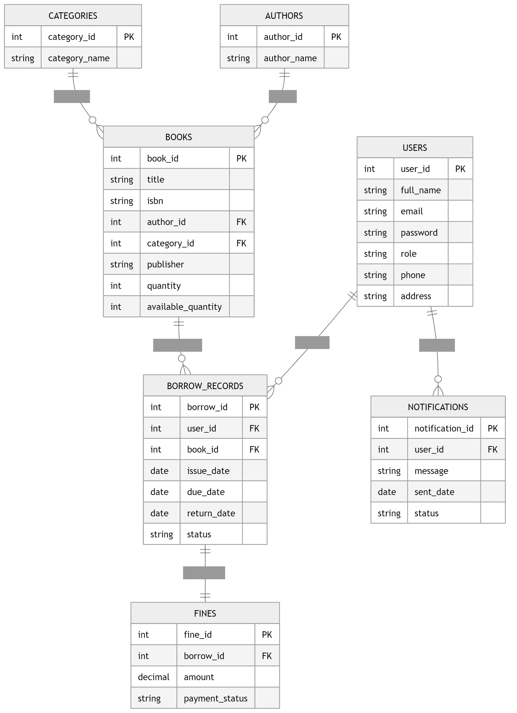

# Software Requirements Specification (SRS)

# Library Management System (LibManage)

---

# Preface

This document provides the Software Requirements Specification (SRS) for the **Library Management System (LibManage)**. It defines the system’s functionalities, performance requirements, security standards, and overall architecture necessary for successful development and deployment.

---

# Version History

| Version | Description                                         |
| ------- | --------------------------------------------------- |
| 1.0     | Initial Draft                                       |
| 1.1     | Added non-functional requirements and system models |
| 1.2     | Updated database design and glossary                |

---

# 1. Introduction

## Purpose

The **Library Management System (LibManage)** is a web-based application designed to automate and simplify library operations such as managing books, members, borrowing records, fines, notifications, and reports. The system improves efficiency, reduces manual work, and ensures accurate record management for libraries.

---

## Document Conventions

This document follows the IEEE SRS standard using:

* **Must** – Mandatory requirements
* **Should** – Recommended requirements
* **May** – Optional enhancements

---

## Intended Audience and Reading Suggestions

### Librarians & Administrators

To understand system operations and management features.

### Developers & System Architects

For implementation guidance and technical development.

### Testers & QA Teams

To verify compliance with requirements.

### Stakeholders & Analysts

To evaluate operational and business requirements.

---

## Scope

The Library Management System provides:

* Book catalog management
* User/member management
* Borrowing and returning books
* Fine calculation and payment tracking
* Search and filtering system
* Reporting and analytics
* Notifications and reminders
* Role-based access control

---

## References

* IEEE Standard 830-1998 (Software Requirements Specification)
* Internal Business Requirement Documentation
* Database Design Documentation

---

# 2. Overall Description

## Product Perspective

The Library Management System is a standalone web application that may integrate with external services such as email systems, barcode scanners, and cloud storage platforms.

---

## Product Functions

### Book Management

Add, update, delete, and organize books.

### User Management

Register and manage librarians and members.

### Borrowing System

Issue and return books with due-date tracking.

### Fine Management

Automatically calculate overdue fines.

### Search and Filtering

Search books by title, author, ISBN, or category.

### Reporting & Analytics

Generate reports related to borrowing history, overdue books, and inventory.

### Notifications

Send reminders for due dates and overdue books.

---

## User Classes and Characteristics

### Admin

* Manages users and permissions
* Controls system settings
* Generates reports

### Librarian

* Manages books and members
* Issues and receives books
* Handles fines and notifications

### Member/Student

* Searches books
* Borrows and returns books
* Views borrowing history and fines

---

## Operating Environment

* Web-based application
* Supported browsers: Chrome, Firefox, Edge
* Cloud or local server deployment
* Database: MySQL / MongoDB

---

## Design and Implementation Constraints

* Must comply with security and privacy standards
* Must support scalable database architecture
* Internet connection required for online functionality

---

## Assumptions and Dependencies

* Users have valid login credentials
* Email service required for notifications
* Barcode scanner integration may be added later

---

# 3. System Requirements Specification

# Functional Requirements

---

## 3.1 User Authentication

### Requirements

* The system must allow users to register and log in.
* The system must support password reset functionality.
* The system must implement role-based authentication.
* The system must securely store encrypted passwords.

---

## 3.2 Book Management

### Requirements

* Librarians must be able to add books.
* Librarians must be able to edit or remove books.
* The system must maintain:

  * Book title
  * Author
  * ISBN
  * Category
  * Publisher
  * Quantity available
* The system should support barcode-based identification.

---

## 3.3 Member Management

### Requirements

* Admins and librarians must be able to register members.
* The system must maintain member profiles.
* The system must track borrowing history for each member.

---

## 3.4 Borrowing and Returning System

### Requirements

* Librarians must be able to issue books.
* The system must record issue date and due date.
* Members must be able to return borrowed books.
* The system must automatically update book availability.

---

## 3.5 Fine Management

### Requirements

* The system must calculate overdue fines automatically.
* Librarians must be able to record fine payments.
* Members should be able to view unpaid fines.

---

## 3.6 Search and Filtering

### Requirements

* Users must be able to search books by:

  * Title
  * Author
  * ISBN
  * Category
* The system should support filtering and sorting.

---

## 3.7 Notifications

### Requirements

* The system must send reminders before due dates.
* The system must notify users about overdue books.
* The system may support email and SMS notifications.

---

## 3.8 Reporting and Analytics

### Requirements

* Admins must be able to generate reports.
* Reports should include:

  * Borrowed books
  * Overdue books
  * Fine collections
  * Inventory status
* Reports should be exportable in PDF and CSV formats.

---

# Non-Functional Requirements

---

## 4.1 Performance Requirements

* The system must support at least 500 concurrent users.
* Search results should appear within 2 seconds.
* Borrowing and return transactions must update instantly.

---

## 4.2 Security Requirements

* The system must implement role-based access control.
* All sensitive data must be encrypted.
* User sessions must expire after inactivity.
* The system must prevent unauthorized access.

---

## 4.3 Usability Requirements

* The system should provide an intuitive UI/UX.
* Navigation should be simple and user-friendly.
* The system must support accessibility standards.

---

## 4.4 Reliability and Availability

* The system must ensure 99.9% uptime.
* Automatic backups must be maintained.
* Recovery mechanisms must be implemented.

---

## 4.5 Maintainability and Support

* The system must support modular architecture.
* Logging and debugging mechanisms must be available.
* Future upgrades should be easy to implement.

---

## 4.6 Portability

* The system should support:

  * Windows
  * Linux
  * macOS
* The system must support cloud deployment.

---

# 5. System Models

## Use Case Diagram (Description)

### Admin

* Manage users
* Configure system settings
* Generate reports

### Librarian

* Manage books
* Issue/return books
* Manage fines

### Member

* Search books
* Borrow and return books
* View history and notifications

---

# 6. Database Requirements

## Main Tables/Collections

* Users
* Books
* Authors
* Categories
* Borrow Records
* Fines
* Notifications

---

## ER Model Description

The ER Model includes relationships between:

* Users and Borrow Records
* Books and Borrow Records
* Authors and Books
* Categories and Books
* Borrow Records and Fines
* Users and Notifications

---

# 7. Future Enhancements

* Mobile application support
* QR/Barcode scanner integration
* AI-based book recommendation system
* Online reservation system
* Digital library and e-book integration

---

# 8. Glossary

| Term          | Meaning                            |
| ------------- | ---------------------------------- |
| ISBN          | International Standard Book Number |
| Borrow Record | Record of issued books             |
| Fine          | Penalty for overdue books          |
| Admin         | System administrator               |
| Member        | Registered library user            |

---

# 9. Conclusion

The Library Management System aims to improve library operations through automation of book tracking, borrowing management, reporting, and communication. The system ensures efficiency, scalability, security, and reliability for educational institutions and organizations.

